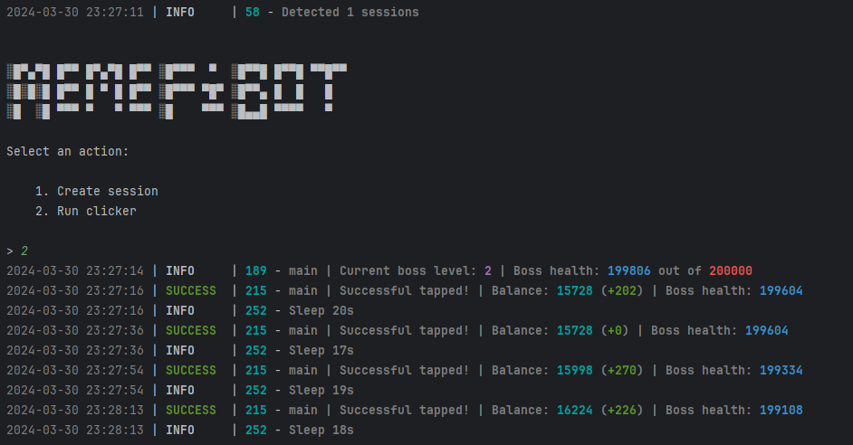

README in english available [**here**](https://github.com/glaciers64/MemeFiBot/blob/main/README-EN.md)

## Recommendation before use

# 🔥🔥 PYTHON version must be 3.10 🔥🔥
## Prerequisites
Before you begin, make sure you have the following installed:
- [Python](https://www.python.org/downloads/) **version 3.10**

## Obtaining API Keys
1. Go to my.telegram.org and log in using your phone number.
2. Select "API development tools" and fill out the form to register a new application.
3. Record the API_ID and API_HASH provided after registering your application in the .env file.

# Support the Project

If you find this project helpful and would like to support its continued development, please consider making a donation. Every contribution helps keep the project alive and growing!

### 💰 How to Donate:

You can donate via the following platforms:

 **Crypto**  
   - **Ton**: `UQAKiyyfkYpQSOwqxAv75gzlyUsHyW3-D43ys0ILxezNpT7R`
   - **Ethereum**: `0xa8909D3182Cdd46ec81432fd9258BA4547900F8d`
   - **Bitcoin**: `bc1q6y2q6r2mnagruzh8srz8qfjuene8s3av7j8rdu`

Your donations help:
 
- Support further development and bug fixes.
- Add new features and improve existing ones.
- Keep the project free and open-source for everyone!

Thank you for your generosity and support! 🙏

### Contacts
For support or questions, you can contact me 
